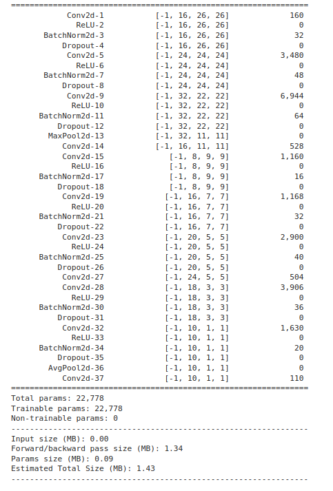
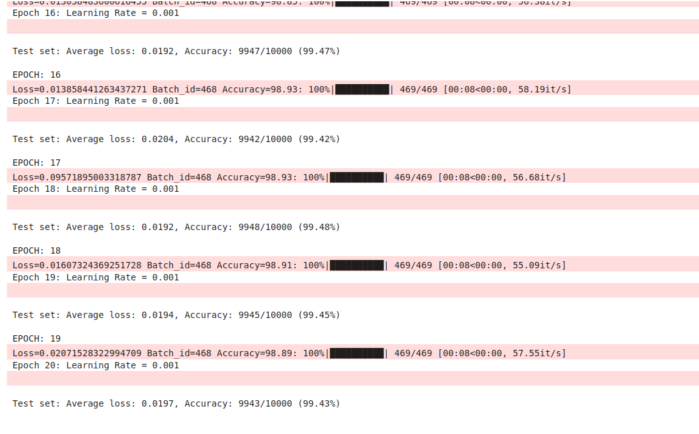

# MNIST Neural Network

## Model Details
- Parameters: < 25,000
- Test Accuracy: > 99.4%

## Tests
This repository includes automated tests that verify:
1. The model has less than 25,000 parameters
2. The model achieves > 99.4% accuracy on the MNIST test set

The test status badge above shows whether the model currently passes these requirements.

## Model Architecture Summary

### Model Size Summary
| Metric | Value |
|--------|-------|
| Total params | 22,778 |
| Trainable params | 22,778 |
| Non-trainable params | 0 |
| Input size (MB) | 0.00 |
| Forward/backward pass size (MB) | 1.34 |
| Params size (MB) | 0.09 |
| Estimated Total Size (MB) | 1.43 |

### Test Logs

